# HOTELAS – Hotel Booking System 🏨

A modern, user-friendly hotel booking platform developed by a team of fullstack developers from March 11, 2025, to May 8, 2025. HOTELAS enables seamless hotel searches, room bookings, and secure payments, delivering an exceptional user experience.

## 📋 Project Overview
HOTELAS is a robust web application designed for hotel reservations, featuring a scalable backend and an intuitive, responsive frontend. Users can effortlessly search for hotels, explore room details, apply discounts, and complete bookings with secure payment integration via VNPay. The system prioritizes security, scalability, and a polished user experience.

## 🛠️ Technologies Used
- **Backend**: Spring Boot, Spring Data JPA, Spring Security, JWT, OAuth2, RESTful API
- **Database**: MySQL, Redis
- **Frontend**: ReactJS, Redux, Bootstrap
- **Tools**: Docker, GitHub, Postman

## ✨ Key Features
- 🔍 **Search & Browse**: Find hotels and view detailed room information.
- 💳 **Secure Payments**: Integrated with VNPay for seamless transactions.
- 🛡️ **Authentication**: Secure login with JWT and Google OAuth2.
- 🚀 **Scalability**: Containerized deployment using Docker.
- 🎨 **Responsive UI**: Modern, intuitive interface built with ReactJS and Bootstrap.

## 🚀 Getting Started
Follow these steps to set up and run HOTELAS locally:

1. **Clone the Repository**:
   ```bash
   git clone <repository-url>
   ```
2. **Configure Environment**:
   - Create `.env` files for MySQL, Redis, and VNPay credentials.
3. **Run with Docker**:
   - Ensure Docker and Docker Compose are installed.
   - Build and start the application:
     ```bash
     docker-compose up --build
     ```
   - Access the app at `http://localhost:3000` (or your configured port).

## 🖥️ UI Demo
Discover the sleek and responsive user interface of HOTELAS, crafted with ReactJS and Bootstrap for an engaging experience. Below are the key UI highlights, organized for clarity and visual appeal.

### 🏠 Homepage
The homepage offers an interactive search bar and showcases featured hotels, making it easy to start your booking journey.

- **Screenshots**:
  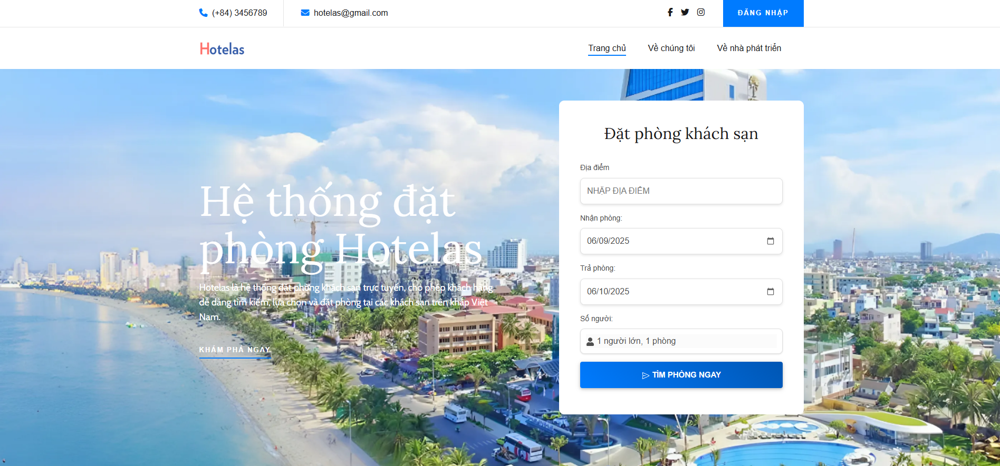
  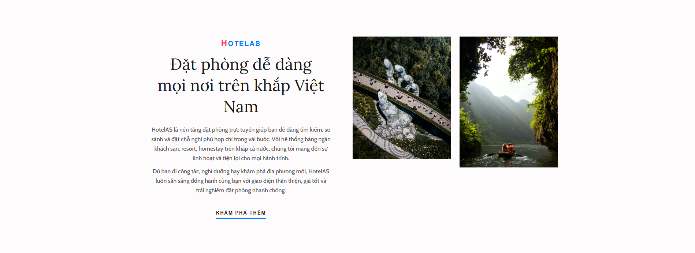
  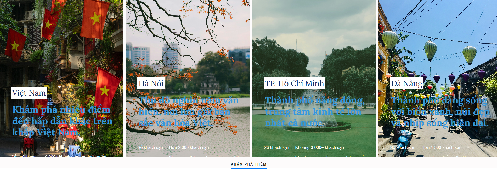
- **Description**: A vibrant, user-friendly interface with a powerful search tool and curated hotel listings.

### 🛏️ Room Details
Explore comprehensive room information, including high-quality images, pricing, and available discounts.

- **Screenshots**:
  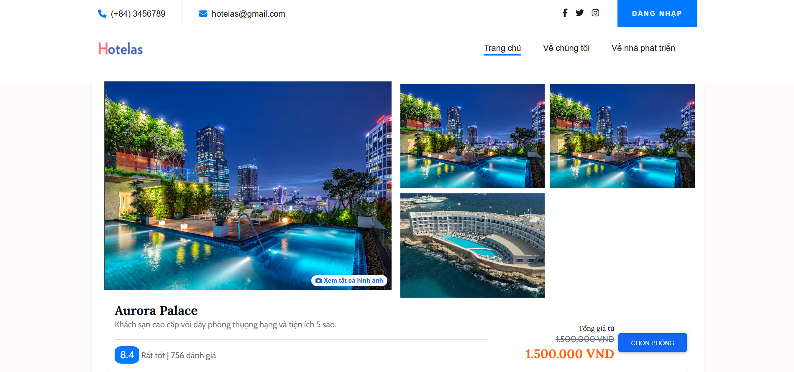
  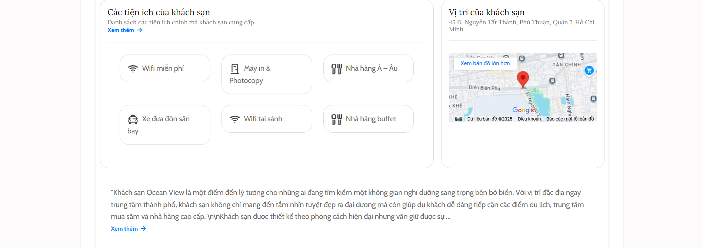
  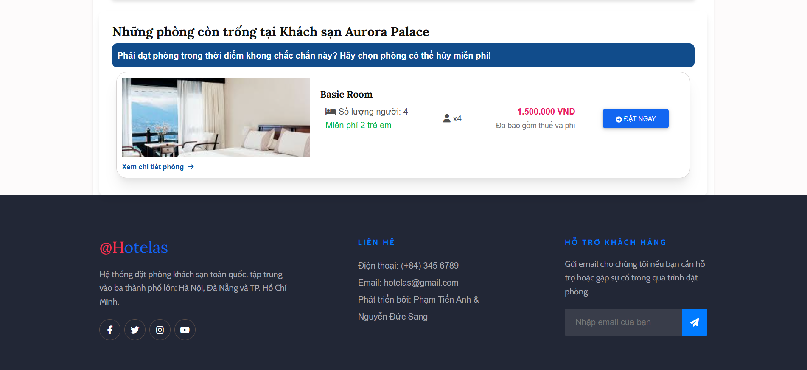
- **Description**: Detailed room views with clear pricing and booking options for a seamless user experience.

### 🔄 Booking Process – 3 Simple Steps
HOTELAS simplifies booking into three intuitive steps, ensuring a smooth and secure process.

#### 🔹 Step 1: Customer Information
Enter essential details such as full name, email, and phone number to initiate the booking.

- **Screenshots**:
  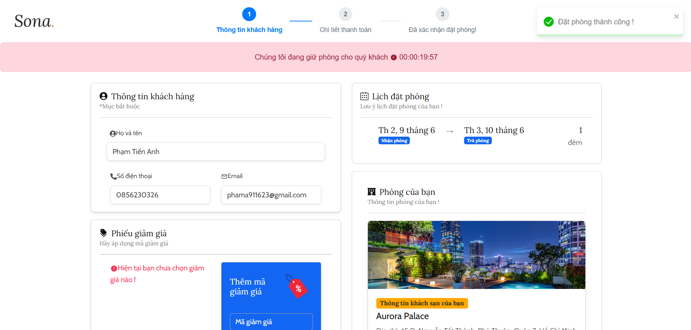
  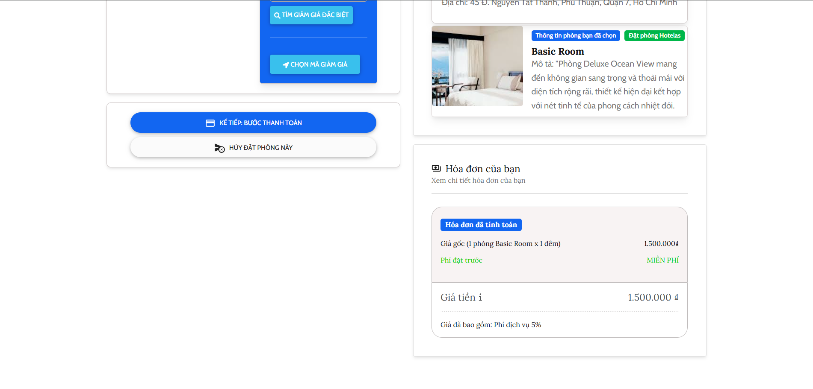
  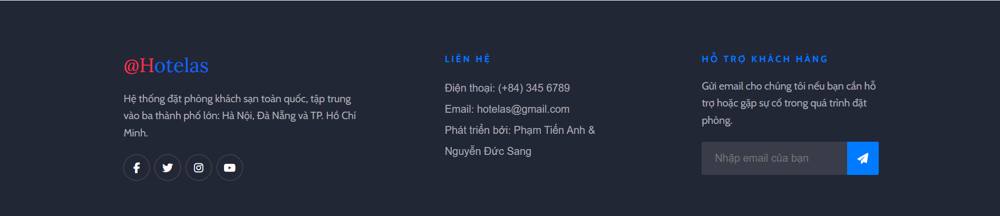
- **Description**: A clean, straightforward form to collect guest information.

#### 🔹 Step 2: Payment
Select a payment method, apply discount codes, and complete the transaction securely via VNPay.

- **Screenshots**:
  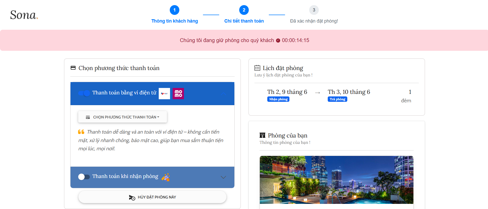
  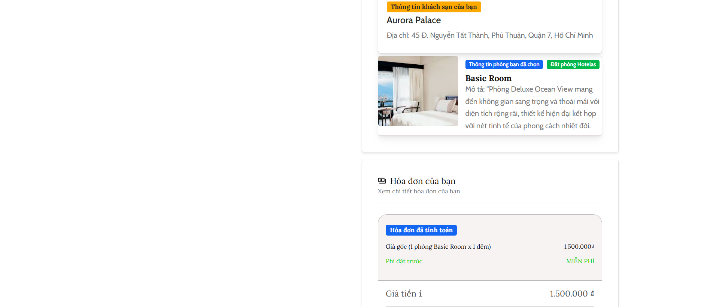
  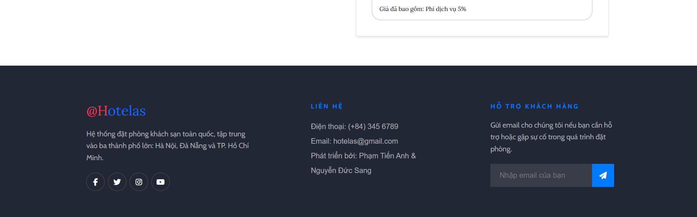
- **Description**: Secure and flexible payment options with real-time discount application.

#### 🔹 Step 3: Payment Confirmation
Receive instant booking confirmation with transaction status and a detailed summary.

- **Screenshots**:
  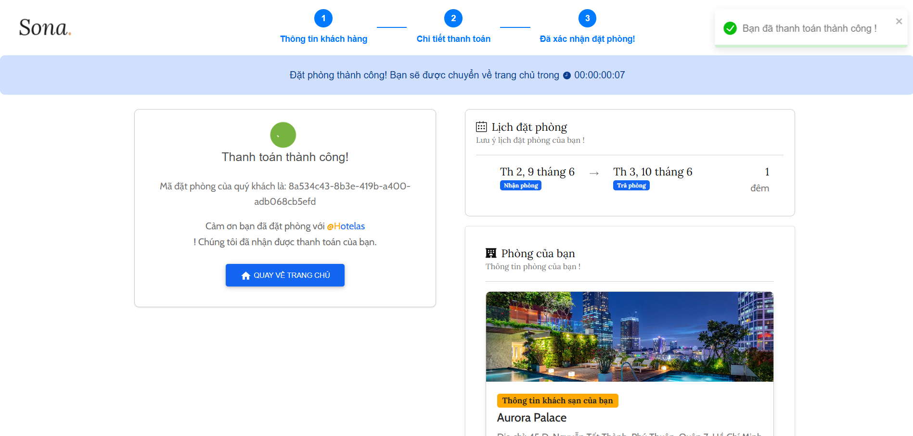
- **Description**: A clear, concise confirmation page to finalize the booking process.

### 🔐 Login & Google Sign-in
Access your account securely with email/password or Google OAuth2 for a quick and safe login experience.

- **Screenshots**:
  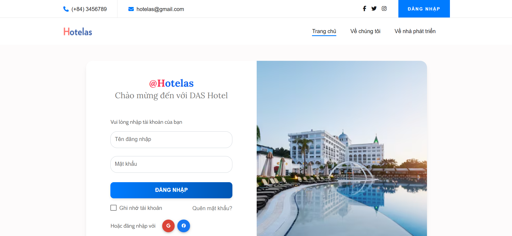
  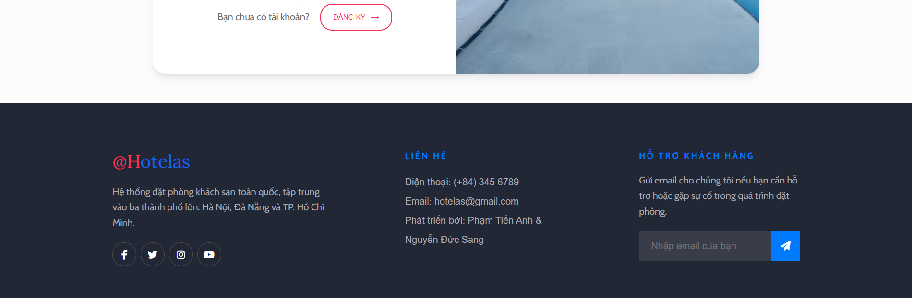
- **Description**: Fast, secure authentication with multiple login options.

### 🔎 Search Rooms
Find available rooms by location, date range, and guest count with real-time filtering.

- **Screenshots**:
  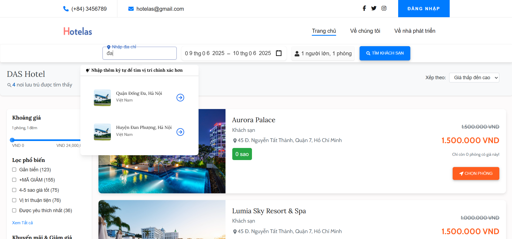
  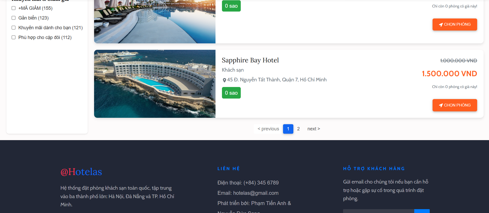
  
- **Description**: A powerful search tool delivering instant results tailored to user preferences.

### 👤 Personal Profile
Manage your profile, view booking history, and update personal details in one centralized hub.

- **Screenshots**:
  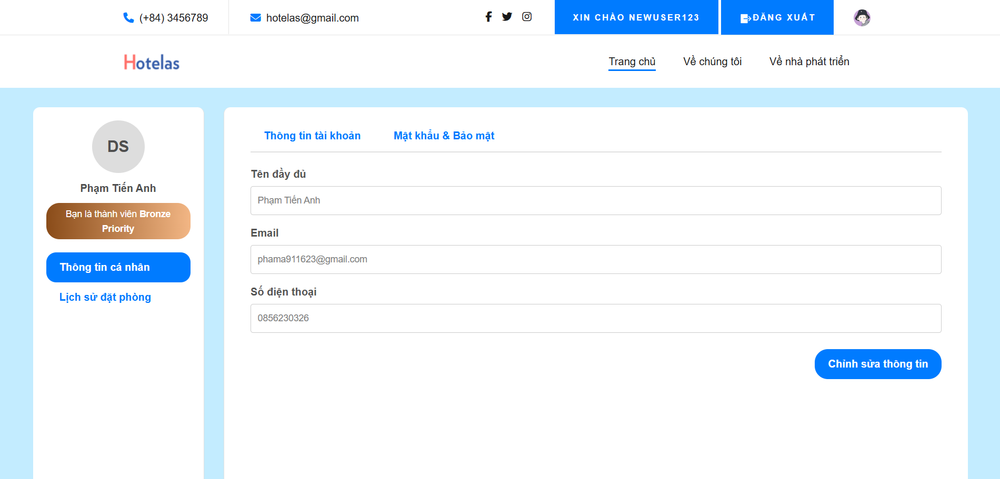
  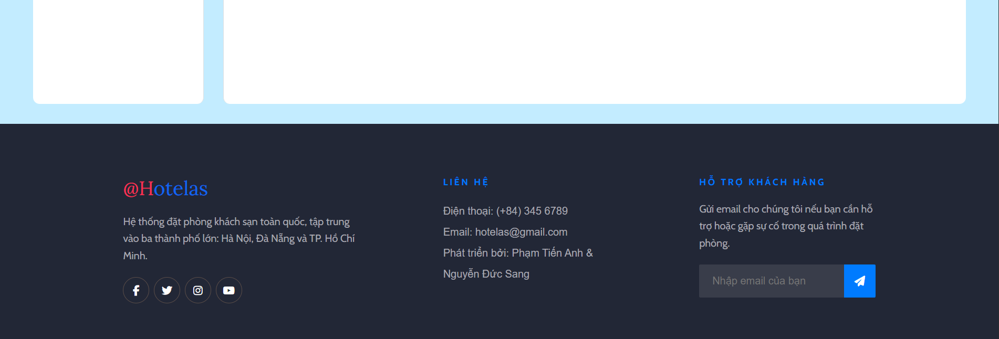
- **Description**: A user-friendly interface for managing account details and tracking bookings.